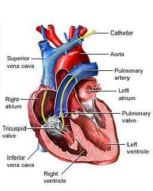

```{r include=FALSE}
library(tidyverse)
library(tufte)
library(knitr)
options(
  htmltools.dir.version = FALSE, # for blogdown
  show.signif.stars = FALSE,     # for regression output
  digits = 2
  )
knitr::opts_chunk$set(eval = FALSE)
```


**Due:** 1 hour after class ends


# Housekeeping
## Structure and format
You will work in your pre-assigned teams. Each team should submit ONLY ONE report for this exercise. You must write the names of all team members at the top of the report containing your responses. You all must do the work using one student's computer and R/RStudio. 

Have one team member open R/RStudio on their computer and share their screen with the other team members within the breakout room. At the top of the team report, write **"host"** in parenthesis besides this student's name. Have another team member be responsible for documenting the responses. At the top of the team report, write **"writer"** in parenthesis besides this student's name. 

**NOTE**: Generally, you will not be penalized for not taking on these roles many times during the semester. This is to simply ensure that you do switch the roles around a "decent number" of times within each team throughout the semester. That said, I will penalize any student who obviously dominates these roles over everyone else, so be sure to give other students an opportunity to do them.

## R/RStudio
You all should have R and RStudio installed on your computers by now. If you do not, first install the latest version of R here: https://cran.rstudio.com (remember to select the right installer for your operating system). Next, install the latest version of RStudio here: https://www.rstudio.com/products/rstudio/download/. Scroll down to the "Installers for Supported Platforms" section and find the right installer for your operating system.


## Gradescope
Gradescope will let you select your team mates when submitting, so make sure to do so. Only one person needs to submit the sheet on Gradescope. You can submit your document in the most common formats, but **pdf** files are preferred. Submit on Gradescope here: https://www.gradescope.com/courses/280392/assignments. Be sure to submit under the right assignment entry.


# Introduction

The purpose of this lab is to help you gain some experience doing causal inference.

```{r fig.margin = TRUE, echo = FALSE, eval=TRUE, fig.width=4}

```

Right Heart Catheterization (RHC) is a procedure for directly measuring how well the heart is pumping blood to the lungs. The procedure involves an insertion of a catheter (hollow tube) into right side of heart and through to pulmonary artery to monitor heart function and blood flow from the heart to lungs. RHC is often applied to critically ill patients for directing immediate and subsequent treatment. However, administering RHC may cause serious complications, though the risks are usually small. There is some debate whether the use of RHC actually leads to improved treatment.


# The Data

This is the same data from the last in-class exercise. so you should already have it saved locally. Just in case you do not, follow the instructions below.

Download the data file (named `rhc.txt`) from Sakai and save it locally to the same directory as your R markdown file. To find the data file on Sakai, go to Resources $\rightarrow$ Datasets $\rightarrow$ In-Class Analyses. Once you have downloaded the data file into the SAME folder as your R markdown file, load and clean the data by using the following R code.

```{marginfigure}
Remember to double-check the dimensions and first few rows of the data to confirm you have the right file. Also, convert the two variables `treatment` and `dth30` to binary variables. You MUST exclude the variable `surv2md1` from the analysis, as shown in the code, so that you are left with 51 covariates.
```

```{r eval = FALSE}
# Load libraries
library(ggplot2)
library(cobalt)
library(MatchIt)
library(randomForest)

# Read in the data
RHC <- read.table("rhc.txt",header=T,stringsAsFactors = T)
RHC <- RHC[,-which(names(RHC)=="surv2md1")]
RHC[,sapply(RHC,is.logical)] <- 
  lapply(RHC[,sapply(RHC,is.logical)], as.factor)
#RHC$treatment <- as.numeric(RHC$treatment) - 1 #optional
RHC$dth30 <- as.numeric(RHC$dth30) - 1
```

The dataset contains data on 5735 hospitalized adult patients at five medical centers in the U.S. The variable `treatment` indicates whether RHC was applied within 24 hours of admission (TRUE/FALSE). Each patient was followed up with some treatment procedures that may have been influenced by the RHC result if it was performed on the patient. 

**The outcome variable is `dth30` -- death at 30 days (TRUE: dead; FALSE: alive). Note that after loading in the data, we have now converted this variable to binary, so that, 1 = dead and 0 = alive**

Based on information from a panel of experts, a set of 52 variables were identified that are potentially related to both the decision to use RHC and the outcome. The goal is to estimate the treatment effect of RHC on death at 30 days. Let *pr(Y(w) = 1) = p<sub>w</sub>* be the fraction of patients with `dth30=1` for treatment group *w* (*w=0* or *1*, that is `rhc/treatment=FALSE` or `rhc/treatment=TRUE` respectively). 

**The target estimand is the average causal effect *Q = p<sub>1</sub> - p<sub>0</sub>* for patients with `treatment=TRUE`.**

That is, we will focus on estimating ATT and not ATE, that is, treatment effect for those who actually received RHC. Clearly, this analysis models death, which means high probabilities are BAD. If RHC works, ATT should be negative.

<!-- This data is based on the data analysis part of: https://stat.duke.edu/sites/stat.duke.edu/files/site-images/FYE13.pdf (the problem and data are actually slightly different). -->


## Code book  

Download the code book for the data (named `rhc_codebook.pdf`) from Sakai; go to the same folder you downloaded the data file from.


# Exercises

      
1. Estimate the propensity score *e* using a logistic regression with all covariates entering in the model as main effects. Assess overlap. Are there any observations with an estimated propensity score *e* that is out of the range of *e* in the other group? If there are only a few such outliers (less than 5), keep them; If many, discard them and report the number of the discarded observations.  
  *<font color="red">You may find the following code useful.</font>*  
    ```{r eval = FALSE}
#Fit the model
cov_names <- names(RHC)
p_formula <- as.formula(paste("treatment ~",
                              paste(cov_names[!cov_names %in% c("dth30","treatment")],
                                    collapse = " + ")))
pscorereg <- glm(p_formula,......)
pscores <- ...... #predict propensity scores here

#Check number of observations outside of the overlap region between the two groups
#First the left tails
sum(pscores < max(min(pscores[RHC$treatment==FALSE]),
                  min(pscores[RHC$treatment==TRUE])))
#Next the right tails
sum(pscores > min(max(pscores[RHC$treatment==FALSE]),
                  max(pscores[RHC$treatment==TRUE])))

#If there are "outliers",
#get row index for observations that violate overlap.
index <- which((pscores < max(min(pscores[RHC$treatment==FALSE]),
                             min(pscores[RHC$treatment==TRUE])) |
             pscores > min(max(pscores[RHC$treatment==FALSE]),
                               max(pscores[RHC$treatment==TRUE]))) == TRUE)
RHC <- RHC[-index,]; pscores <- pscores[-index]
```

2. Do one-to-one, nearest neighbor matching on the estimated propensity scores.  
  *<font color="red">Set this up so that you discard observations in the control group for which you do not find matches for. You may find the following code useful.</font>*  
    ```{r eval = FALSE}
matches <- matchit(p_formula,method=...,
                   distance=...,data=...)
```

3. Extract the matched data and check balance again. Are the covariates balanced now? If no, which ones are not?

4. Estimate the average causal effect $Q$ using the matched sample obtained above. Construct a 95% confidence interval using the normal approximation as I did at the end of the video for Module 6.8. Interpret your findings. Are treated patients better or worse off with RHC?  
  *<font color="red">Note that the estimated average causal effect computed on the matched sample is the ATT we want (where the treated group is `treatment = TRUE`) and not ATE, because we will discard observations in the control group for which we cannot find matches for. This is something you should keep in mind should you want to estimate ATE on your own projects and applications in the future.</font>*

5.
```{marginfigure}
Note that this estimated effect is no longer an estimate of *Q = p<sub>1</sub> - p<sub>0</sub>* but intuitively, we can still draw "roughly" the same conclusions from it.
```
Fit a logistic regression to the response variable using the main effects of all covariates. Also include the new propensity scores *e* from question 7 as a predictor. Report the estimated causal odds ratio and its corresponding confidence interval. Interpret your findings.


<!-- # Acknowledgement -->

<!-- This exercise is based on ideas proposed by [Sam Voisin](https://stat.duke.edu/people/sam-voisin). -->


