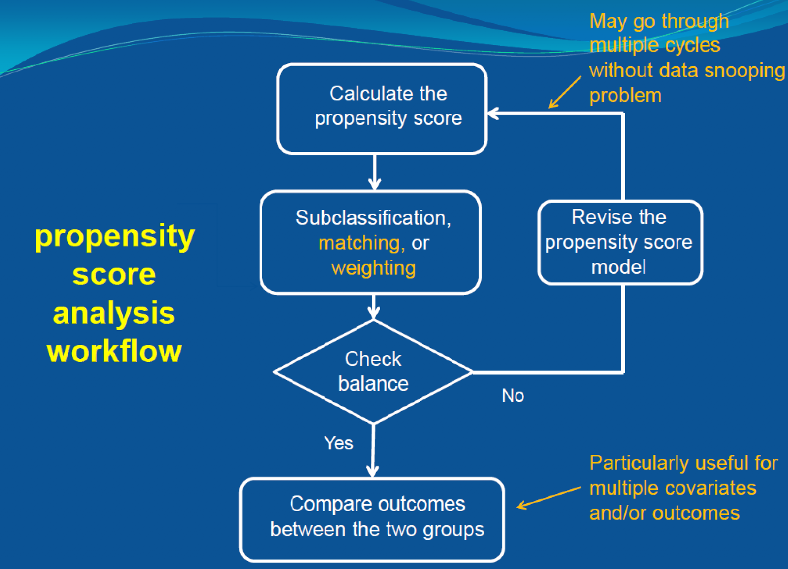

```{r packages, echo=FALSE, message=FALSE, warning=FALSE}
#library(tidyverse)
#library(magick)
library(knitr)
library(kableExtra)
library(lattice)
#library(dplyr)
#library(ggplot2)
#library(arm)
library(DiagrammeR)
library(MatchIt)
library(cobalt)
```

```{r setup, include=FALSE}
# R options
options(
  htmltools.dir.version = FALSE, # for blogdown
  #show.signif.stars = FALSE,     # for regression output
  warm = 1
  )
# Set dpi and height for images
knitr::opts_chunk$set(fig.height = 2.65,dpi =300,fig.align='center',fig.show='hold',size='footnotesize',small.mar=TRUE) 
# For nonsese...
htmltools::tagList(rmarkdown::html_dependency_font_awesome())
# For magick
dev.off <- function(){
  invisible(grDevices::dev.off())
}

knit_hooks$set(small.mar = function(before, options, envir) {
    if (before) par(mar =  c(4, 4, 1.5, 1.5)) 
})
```


## Causal inference using propensity scores

Propensity score analysis (in observational studies) typically involves two stages:

--

- .hlight[Stage 1]. Estimate the propensity score: by a logistic regression model or machine learning methods.

--

- .hlight[Stage 2]. Given the estimated propensity score, estimate the causal effects through one of these methods:
  + Stratification
  + Matching
  + Regression
  + Weighting (which we will not cover)
  + Mixed combinations of the above
  
--
  
The general idea is to use the estimated propensity scores to correct for lack of balance between groups, then go on to estimate the causal effect using the "balanced" data.
  
  
---
class: center, middle

# Stage 1: estimating the propensity score


---
## Stage 1: estimating the propensity score

- The main purpose of estimating propensity score is to ensure .hlight[overlap and balance of covariates] between treatment groups, instead of “finding a perfect fit" of propensity score.

--

- As long as the important covariates are balanced, .hlight[model overfitting is not a concern]; underfitting can be a problem however.

--

- Essentially any balancing score (not necessarily propensity score) would be good enough for practical use.


---
## Stage 1: estimating the propensity score

- A standard procedure for estimating propensity scores includes:
  1. initial fit;
  
--

  2. discarding outliers (with too large or too small propensity scores);
  
--

  3. check covariate balance; and
  
--

  4. re-fit if necessary.


---
## Stage 1: estimating the propensity score

- .hlight[Step 1.] Estimate propensity score using a logistic regression:
.block[
.small[
$$W_i | X_i \sim \textrm{Bernoulli}(\pi_i); \ \ \ \ \textrm{log}\left(\dfrac{\pi_i}{1-\pi_i}\right) = X_i\boldsymbol{\beta}.$$
]
]

--

  Include all covariates in this initial model or do a stepwise selection on the covariates and interactions to get an initial estimate of the propensity scores. That is,
.block[
.small[
$$\hat{e}^0(X_i) = \dfrac{e^{X_i\hat{\boldsymbol{\beta}}}}{1 + e^{X_i\hat{\boldsymbol{\beta}}}}.$$
]
]

--

  Can also use machine learning methods.

---
## Stage 1: estimating the propensity score

- .hlight[Step 2.] Check overlap of propensity score between treatment groups. If necessary, .hlight[discard the observations with non-overlapping propensity scores].

--

- .hlight[Step 3.] Assess balance given by initial model in Step 1.

--

- .hlight[Step 4.] If one or more covariates are seriously unbalanced, include some of their higher order terms and/or interactions to re-fit the propensity score model and repeat Steps 1-3, until most covariates are balanced.

--

  *.block[Note: There are situations where some important covariates will still not be completely balanced after repeated trials. Then they should be taken into account in Stage 2 (outcome stage) of propensity score analysis.]*
  
  
---
## Stage 1: estimating the propensity score

- In practice, balance checking in the PS estimation stage can be done via sub-classification/stratification, matching or weighting.
--

  + sub-classification/stratification: check the balance of all important covariates within $K$ blocks of $\hat{e}^0(X_i)$ based on its quantiles.
--

  + matching: check the balance of all important covariates in the matched sample.
--

  + in weighting, check the balance of the weighted covariates between treatment and control groups.
  
- The workflow is the same: .hlight[fit initial model, check balance (sub-classification, matching or weighting), then refit].


---
## Propensity score analysis workflow

```{r echo=FALSE, out.height="500px"}

```


---
class: center, middle

# Stage 2: estimating the causal effect


---
## Stage 2: stratification

- Given the estimated propensity score, we can estimate the causal estimands through  sub-classification/stratification, weighting or matching.

--

- Let's start with stratification.

--

- Recall that the result of 5 strata of a single covariate removes 90% bias.

--

- Stratification using propensity score as the summary score should have approximately the same effects.


---
## Stage 2: stratification

- Divide the subjects in to $K$ strata by the corresponding quantiles of the estimated propensity scores.

--

- .hlight[ATE]: estimate ATE within each stratum and then average by the block size. That is,
.block[
.small[
$$\hat{\tau}^{ATE} = \sum_{k=1}^K \left(\bar{Y}_{k,1} - \bar{Y}_{k,0} \right) \dfrac{N_{k,1}+N_{k,0}}{N},$$
]
]

  with $N_{k,1}$ and $N_{k,0}$ being the numbers of units in class $k$ under treated and control, respectively.

--

- .hlight[ATT]: weight within-block ATE by proportion of treated units $N_{k,1}/N_1$.

--

- A variance estimator for $\hat{\tau}^{ATE}$ is 
.block[
.small[
$$\mathbb{Var}\left[\hat{\tau}^{ATE}\right] = \sum_{k=1}^K \left(\mathbb{Var}[\bar{Y}_{k,1}] - \mathbb{Var}[\bar{Y}_{k,0}] \right) \left(\dfrac{N_{k,1}+N_{k,0}}{N}\right)^2,$$
]
]

  or use bootstrap.


---
## Propensity score stratification: Remarks

- 5 blocks is usually not enough, consider higher number such as 10.

--

- Stratification is a coarsened version of matching.

--

- Empirical results from real applications and situations: usually not as good as matching or weighting.

--

- Good for cases with extreme outliers (smoothing): less sensitive, but also less efficient.

--

- Can be combined with regression: first estimate causal effects using regression within each block and then average the within-subclass estimates.


---
## Stage 2: matching

- In propensity score matching, potential matches are compared using (estimated) propensity score.

--

- 1-to-n closest neighbor matching is common when the control group is large compared to treatment group.

--

- In most software packages, the default is actually 1-to-1 closest neighbor matching.

--

- Pros: robust, matched pairs (so you can do within pair analysis).

--

- Sometimes, dimension reduction via the propensity score may be too drastic, recent methods advocate matching on the multivariate covariates directly.

--

- Nonetheless, this is what we will focus on for our minimum wage data.


---
## Stage 2: regression

- Remember the key propensity score property:
.block[
.small[
$$
\{Y_i(0), Y_i(1)\} \perp W_i | X_i \ \ \Rightarrow \ \ \{Y_i(0), Y_i(1)\} \perp W_i | e(X_i)
$$
]
]

--

- Idea: in a regression estimator, adjusting for $e(X)$ instead of the whole $X$; thus in regression models of $Y(w)$ use
$e(X)$ as the single predictor.

--

- Clearly, modeling $\mathbb{Pr}(Y(w)|\hat{e}(X))$ is simpler than modeling $\mathbb{Pr}(Y(w)|X)$; effectively more data to estimate essential parameters due to the dimension reduction.

--

- However,
  + we lose interpretation of the effects of individual covariates, e.g. age, sex; and
  
--

  + reduction to the one-dimensional propensity score may be too drastic.


---
## Stage 2: regression

- Idea: instead of using the estimated $\hat{e}(X)$ as the single predictor, use it as an additional predictor in the model. That is, $\mathbb{Pr}(Y(w)|X,\hat{e}(X))$.

--

- Turns out that $\mathbb{Pr}(Y(w)|X,\hat{e}(X))$ gives both efficiency and robustness.

--

- Also, if we are unable to achieve full balance on some of the predictors, using $\mathbb{Pr}(Y(w)|X,\hat{e}(X))$ will help further control for those unbalance predictors.

--

- Empirical evidences (e.g. simulations) support this claim.


---

class: center, middle

# What's next? 

### Move on to the readings for the next module!


