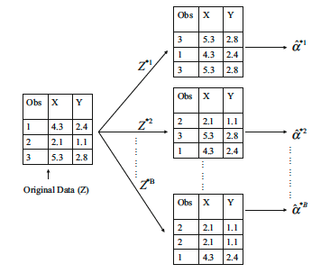

```{r packages, echo=FALSE, message=FALSE, warning=FALSE}
#library(tidyverse)
#library(magick)
library(knitr)
#library(kableExtra)
#library(lattice)
#library(dplyr)
#library(ggplot2)
#library(arm)
```

```{r setup, include=FALSE}
# R options
options(
  htmltools.dir.version = FALSE, # for blogdown
  #show.signif.stars = FALSE,     # for regression output
  warm = 1
  )
# Set dpi and height for images
knitr::opts_chunk$set(fig.height = 2.65,dpi =300,fig.align='center',fig.show='hold',size='footnotesize',small.mar=TRUE) 
# For nonsese...
htmltools::tagList(rmarkdown::html_dependency_font_awesome())
# For magick
dev.off <- function(){
  invisible(grDevices::dev.off())
}

knit_hooks$set(small.mar = function(before, options, envir) {
    if (before) par(mar =  c(4, 4, 1.5, 1.5)) 
})
```


## Introduction

- When building statistical models, we often need to quantify the uncertainty around the estimated parameters we are interested in.

--

- So far in this class, we have been doing so using standard errors and confidence intervals. 

--

- Computing standard errors is often straightforward when we have closed forms. 

--

- For example, the standard error for $\bar{X}$ is $\sigma/\sqrt{n}$.

--

-  When $\sigma$ is unknown, replace with $s = \hat{\sigma}$.

--

- What to do when we do not have closed forms?


---
## Introduction

- Setting confidence intervals and conducting hypotheses testing often requires us to know the distribution of the parameter of interest. 

--

- A key tool for doing this is the central limit theorem.

--

- Recall that according to CLT, for large samples, averages and sums are approximately normally distributed.

--

- With some work, the CLT allows confidence intervals and hypotheses testing on means, proportions, sums, intercepts, slopes, and so on. 

--

- But...what if we want to set confidence intervals on a correlation or an sd or a ratio?


---
## Introduction

- Once neat solution is to approximate whatever distribution you have in mind via re-sampling from the true population.

--

- For example, suppose I would like to estimate the average income of Durham residents and quantify uncertainty around my estimate.

--

- First I need a sample (of course!).

--

- Suppose I sample 1000 residents and record their income as $X_1, \ldots, X_{1000}$. Then, my estimate of average income is $\bar{X}$.

--

- Next, I should quantify my uncertainty around that number. I can do so using the standard error $\sigma/\sqrt{n}$ mentioned earlier, which relies on the CLT.


---
## Bootstrap

- Alternatively, I could approximate the entire distribution of average income myself as follows:

--

  1. Generate $B=100$ different samples of 1000 Durham residents.
  
--

  2. For each set $b = 1, \ldots, B$ of 1000 residents, compute $\bar{X}^b$.
  
--

  3. Make a histogram of all $\bar{X}^1, \ldots, \bar{X}^{100}$ values. This approximates the distribution of average income of Durham residents.
  
--

- Point estimate of average income is thus the mean of $\bar{X}^1, \ldots, \bar{X}^{100}$.

--

- To quantify uncertainty, can use the standard deviation of $\bar{X}^1, \ldots, \bar{X}^{100}$.

--

- For confidence intervals, use the quantiles of the histogram.

--
  
- In practice, however, the procedure above cannot be applied, because we  usually cannot generate many samples from the original population. 

--

- What to do then? .hlight[Bootstrap]!


---
## Bootstrap

- .hlight[Bootstrap] is a very powerful statistical tool. 

--

- It can be used to "approximate" the distribution of almost any parameter of interest.

--

- .block[Bootstrap allows us to mimic the process of obtaining new sample sets by repeatedly sampling observations from the original data set.]

--

- That is, replace step 1 of the previously outlined approach with
  1. Generate $B=100$ different samples of 1000 Durham residents by re-sampling from the original observed sample with replacement.
 
--
 
- Can then follow the remaining steps to approximate the distribution of the parameter of interest.

--

- Ideally, the sample you start with should be representative of the entire population. Bootstrap relies on the original sample!


---
## Bootstrap

Here's a figure from the [ISL](http://faculty.marshall.usc.edu/gareth-james/ISL/) book illustrating the approach.

```{r echo=FALSE, out.height="480px",out.width="600px"}

```


---

class: center, middle

# What's next? 

### Move on to the readings for the next module!


