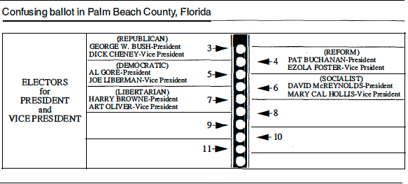

## Instructions

This assignment involves linear regression. The data can be found on Sakai: go to Resources $\rightarrow$ Datasets $\rightarrow$ Data Analysis Assignments $\rightarrow$ Assignment 1. Please type your solutions using R Markdown, LaTeX or any other word processor but YOU MUST knit or convert the final output file to ".pdf". Submissions should be made on gradescope: go to Assignments $\rightarrow$ Data Analysis Assignment 1.

<font color="red">**DO NOT INCLUDE R CODE OR OUTPUT IN YOUR SOLUTIONS/REPORTS** *All R code can be included in an appendix, and R outputs should be converted to nicely formatted tables. Feel free to use R packages such as `kable`, `xtable`, `stargazer`, etc.*</font>

<font color="red">*Also, you can round up ALL numbers/estimates to 2 decimal places (4 decimal places at the most to avoid exact zeros when possible).*</font>

**Reminder: You are allowed and even encouraged to talk to each other about general concepts, or to the instructor/TAs. However, the write-ups, solutions, and code MUST be entirely your own work.**

## Questions

Questions 1 and 2 below were taken and adapted from Chapter 7 of [Ramsey, F.L. and Schafer, D.W. (2013), "The Statistical Sleuth: A Course in Methods of Data Analysis (3rd ed)."](https://www.amazon.com/Statistical-Sleuth-Course-Methods-Analysis/dp/1133490670). 

<font color="green">**Side Note:** We will use textbook datasets on some of the data analysis assignments. This is intentional as a way to start with clean and small datasets. For team projects, we will focus a bit more on "messy" datasets.</font>


1. <font color="blue">RESPIRATORY RATES FOR CHILDREN</font>.
A high respiratory rate is a potential diagnostic indicator of respiratory infection in children. To judge whether a respiratory rate is truly "high," however, a physician must have a clear picture of the distribution of "normal" respiratory rates. To this end, Italian researchers measured the respiratory rates of 618 children that are at most 3 years old.  
    *The data for this question can be found in the file "Respiratory.csv" on Sakai.*  
      + Do exploratory analysis on the data and include a useful plot that a physician could use to assess a "normal" range of respiratory rates for children of any age between 0 and 3.
      + Write down a regression model for predicting respiratory rates from age. Make sure to use the right mathematical notation.
      + Fit the model to the data and interpret your results.
      + Include a table showing the output from the regression model including the estimated intercept, slope, residual standard error, and proportion of variation explained by the model.
      + Is there enough evidence that the model assumptions are reasonable for this data? You should consider transformations (think log transformations, etc) if you think there's a violation of normality and/or linearity.
      + Demonstrate the usefulness of the model by providing 95% prediction intervals for the rate for three individual children: a 1 month old, an 18 months old, and a 29 months old.


2. <font color="blue">THE DRAMATIC U.S. PRESIDENTIAL ELECTION OF 2000.</font>
The U.S. presidential election of November 7, 2000 was one of the closest in history. As returns were counted on election night it became clear that the outcome in the state of Florida would determine the next president. At one point in the evening, television networks projected that the state was carried by the Democratic nominee, Al Gore, but a retraction of the projection followed a few hours later. Then, early in the morning of November 8, the networks projected that the Republican nominee, George W. Bush, had carried Florida and won the presidency. Gore called Bush to concede. While on route to his concession speech, though, the Florida count changed rapidly in his favor. The networks once again reversed their projection, and Gore called Bush to retract his concession. When the roughly 6 million Florida votes had been counted, Bush was shown to be leading by only 1,738, and the narrow margin triggered an automatic recount. The recount, completed in the evening of November 9, showed Bush's lead to be less than 400.  
    Meanwhile, angry Democratic voters in Palm Beach County complained that a confusing "butterfly" lay-out ballot caused them to accidentally vote for the Reform Party candidate Pat Buchanan instead of Gore. The ballot, as illustrated below, listed presidential candidates on both a left-hand and a right-hand page.
<div style= "float:left;position: relative; margin-left: 0px">
```{r setup, echo=FALSE, fig.align="left"}

```
</div>
Voters were to register their vote by punching the circle corresponding to their choice, from the column of circles between the pages. It was suspected that since Bush's name was listed first on the left-hand page, Bush voters likely selected the first circle. Since Gore's name was listed second on the left-hand side, many voters---who already knew who they wished to vote for---did not bother examining the right-hand side and consequently selected the second circle in the column; the one actually corresponding to Buchanan. Two pieces of evidence supported this claim: Buchanan had an unusually high percentage of the vote in that county, and an unusually large number of ballots (19,000) were discarded because voters had marked two circles (possibly by inadvertently voting for Buchanan and then trying to correct the mistake by then voting for Gore).  
    *The data for this question can be found in the file "Elections.csv" on Sakai.*
      + Make a scatterplot of the variables *Buchanan2000* and *Bush2000*. What evidence is there in the scatterplot that Buchanan received more votes than expected in Palm Beach County? 
      + Fit a linear regression model to the data to predict Buchanan votes from Bush votes, without using Palm Beach County results. You should consider transformations for both variables if you think there's a violation of normality and/or linearity.
      + Include the output from the final regression model that you used, as well as evidence that the model fits the assumptions reasonably well.
      + Obtain a 95% prediction interval for the number of Buchanan votes in Palm Beach from this result, assuming the relationship is the same in this county as in the others. If it is assumed that Buchanan's actual count contains a number of votes intended for Gore, what can be said about the likely size of this number from the prediction interval?


3. <font color="blue">AIRBNB LISTINGS FOR SEATTLE, WA.</font>
AirBnB is a rental online marketplace. The company itself is based in San Francisco CA, and there are millions of listings in cities across the world. In this problem, you will only focus on data for AirBnB listings in Queen Anne, Seattle, WA. Specifically, you will try to understand how certain factors influence the price of a listing. The data we will use here is a very small subset of the overall available data. For more on the data, or if you are interested in using AirBnB data, see http://insideairbnb.com/get-the-data.html.    
    *The data for this question can be found in the file "Listings_QueenAnne.txt" on Sakai.*
      + Analyze the data using `host_is_superhost`,`host_identity_verified`, `room_type`, `accommodates`, `bathrooms` and `bedrooms` as predictors. You should start by doing EDA, then model fitting, and model assessment. You should consider transformations if needed.
      + Include the output from the final regression model that you used, as well as evidence that the model fits the assumptions reasonably well. Your regression output should includes a table with coefficients and SEs, and p-values or confidence intervals.
      + Interpret the results of your fitted model in the context of the data.
      + Are there any (potential) outliers, leverage points or influential points? Provide evidence to support your response. Also, if there are influential points and/or outliers, exclude the points, fit your model without them, and report the changes in your overall conclusions.
      + Overall, are there any potential limitations of this analysis? If yes, what are two potential limitations?
    
    **Code Book**
    
    Variable       |        Description
    :------------- | :-------------------
    id | Unique identifier for listings
    host_is_superhost | Whether or not the host is a “superhost,” meaning they satisfy AirBnB’s criteria for high-quality listings, high response rate, and reliability
    host_identity_verified | Whether or not the host has verified their identity with AirBnB
    room_type | Entire home/apt, private room, or shared room
    accommodates | Number of people that the listing can accommodate
    bathrooms | Number of bathrooms in the listing
    bedrooms | Number of bedrooms in the listing
    price | Price of the listing for one night <br /> *(Use this as the response variable)*


## Grading

30 points: 10 points for each question
  
  