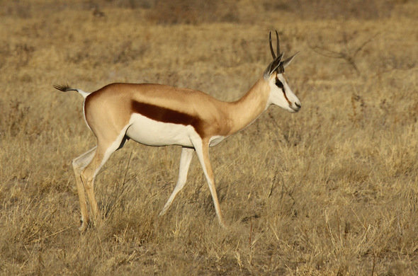

```{r setup, include=FALSE}
# R options
options(
  htmltools.dir.version = FALSE, # for blogdown
  show.signif.stars = FALSE,     # for regression output
  warm = 1
  )
# Set dpi and height for images
library(knitr)
knitr::opts_chunk$set(fig.height = 2.65, dpi = 300,fig.align='center',fig.show='hold',size='footnotesize', small.mar=TRUE) 
# For nonsese...
htmltools::tagList(rmarkdown::html_dependency_font_awesome())
```

```{r echo=FALSE, message=FALSE, warning=FALSE}
library(tidyverse)
library(rvest)
```


## Springbok analysis

The data contains counts of springbok antelope around 25 watering holes.

```{r echo=FALSE, out.height="400px",out.width="400px"}

```

The data is in the file `springbok.csv` on Sakai.


---
## Springbok analysis

- Springbok are counted at each site (hole) at an altitude of 200-300 meters.

--

- A survey normally includes counts at all 25 sites but occasionally some sites could not be counted because of poor weather.

--

- For larger groups of springbok, color photographs were taken and springbok were counted later from the photos. 

--

- Several surveys, usually 7-10, were made each year. 

--

- Within a year, springbok are faithful to a single site. That is, if a springbok goes to site $i$ on one day, it will return to site $i$ on other days.

--

- We want to
  + Analyze trend
  + Estimate the effects of predictors
  
  

---
## Springbok analysis data

- n = 1050 counts from 1990-2002 for sites 12-21, 23, and 24. 

-  The other sites were excluded because they usually don't have many antelope. 

- Three time variables: year, date (week) and hour from noon.

Variable    | Description
:------------- | :------------
LOCNUMBER | Location Number 
SITEI | Site
YEAR | Year (1990 - 2002) 
DATE | Week (14 - 42)
HourFromNoon | Hour From Noon (Numeric)
COUNTS | Springbok Count (Discrete)


---
class: center, middle

# In-class analysis: move to the R script [here](https://ids702-f21.olanrewajuakande.com/slides/Springbok.R)


---

class: center, middle

# What's next? 

### Move on to the readings for the next module!


