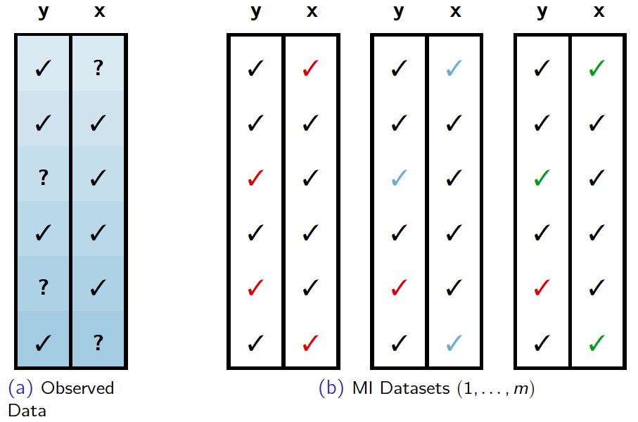
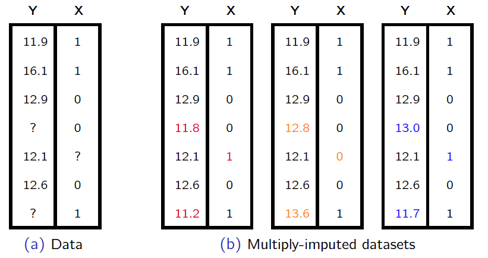

```{r packages, echo=FALSE, message=FALSE, warning=FALSE}
#library(tidyverse)
#library(magick)
library(knitr)
library(kableExtra)
#library(lattice)
#library(dplyr)
#library(ggplot2)
#library(lme4)
#library(arm)
```

```{r setup, include=FALSE}
# R options
options(
  htmltools.dir.version = FALSE, # for blogdown
  #show.signif.stars = FALSE,     # for regression output
  warm = 1
  )
# Set dpi and height for images
knitr::opts_chunk$set(fig.height = 2.65,dpi =300,fig.align='center',fig.show='hold',size='footnotesize',small.mar=TRUE) 
# For nonsese...
htmltools::tagList(rmarkdown::html_dependency_font_awesome())
# For magick
dev.off <- function(){
  invisible(grDevices::dev.off())
}

knit_hooks$set(small.mar = function(before, options, envir) {
    if (before) par(mar =  c(4, 4, 1.5, 1.5)) 
})
```


## Strategies for handling missing data

- Item nonresponse:
  + use complete/available cases analyses
  + single imputation methods
  + multiple imputation
  + model-based methods

--
  
- Unit nonresponse: 
  + weighting adjustments
  + model-based methods (identifiability issues!).

--
  
- .hlight[We will only focus on item nonresponse].

--

- If you are interested in building models for both unit and item nonresponse, here is a paper on some of the research I have done on the topic: https://arxiv.org/pdf/1907.06145.pdf


---
## Complete/available cases analyses

What can happen when using available case analyses with different types of missing data?

--

- MCAR: unbiased when disregarding missing data; variance increase (losing partially complete data)

--

- MAR: biased (depending on the strength of MAR and amount of missing data) when missing data mechanism is not modeled; variance increase (losing partially complete data). 

--

- NMAR: generally biased!


---
## Single imputation methods

--

- Marginal/conditional mean imputation

--

- Nearest neighbor imputation:
  + hot deck imputation
  + cold deck imputation

--

- Use observation from one of the previous time periods (for panel data)
  + LOCF -- last observation carried forward 
  + BOCF -- baseline observation carried forward
  
  
---
## Mean imputation

Plug in the variable mean for missing values.

--

- Point estimates of means OK under MCAR

--

- Variances and covariances underestimated.

--

- Distributional characteristics altered.

--

- Regression coefficients inaccurate.

--

Similar problems for plug-in conditional means.


---
## Nearest neighbor imputation

Plug in donors' observed values.

--

- Hot deck: for each non-respondent, find a respondent who "looks like" the non-respondent in the same dataset

--

- Cold deck: find potential donors in an external but similar dataset. For example, respondents from a 2016 election poll survey might serve as potential donors for non-respondents in the 2018 version of the same survey.

--

- Common metrics: Statistical distance, adjustment cells, propensity scores.


---
## Nearest neighbor imputation

- Point estimates of means OK under MAR.

--

- Variances and covariances underestimated.

--

- Distributional characteristics OK.

--

- Regression coefficients OK under MAR.


---
## Multiple imputation (MI)

- Fill in dataset $m$ times with imputations.

--

- Analyze repeated data sets separately, then combine the estimates from each one.

--

- Imputations drawn from probability models for missing data.

--

```{r echo=FALSE, out.height="370px",out.width="450px"}

```


---
## MI example

Suppose

- $Y =$ income (unit of measurement is $10,000)

--

- $X =$ level of education (0 = undergraduate, 1 = graduate)

--

```{r echo=FALSE, out.height="370px",out.width="450px"}

```


---
## MI: inferences from multiply-imputed datasets

Rubin (1987)

- Population estimand: $Q$

- Sample estimate: $q$

- Variance of $q$: $u$

- In each imputed dataset $d_j$, where $j = 1,\ldots,m$, calculate
$$q_j = q(d_j)$$
$$u_j = u(d_j)$$

---
## MI example: inferences from multiply-imputed datasets

Suppose we are interested in estimating the mean income in our example.  Then

- Q = $\mu_Y$

--

- $q = \bar{y} =  \dfrac{1}{n} \sum\limits_{i=1}^{n} y_i$

--

- u = $\mathbb{\hat{V}}[\bar{y}] = \dfrac{s^2}{n}$

--

- In each imputed dataset $d_j$, calculate
$$q_j =  \bar{y}_j \ \ \ \textrm{and} \ \ \ u_j = \dfrac{s_j^2}{n}$$


---
## MI: quantities needed for inference

- .block[
$$\bar{q}_m = \sum\limits_{i=1}^m \dfrac{q_i}{m}$$
]

- .block[
$$b_m = \sum\limits_{i=1}^m \dfrac{(q_i - \bar{q}_m)^2}{m-1}$$
]

- .block[
$$\bar{u}_m = \sum\limits_{i=1}^m \dfrac{u_i}{m}$$
]


---
## MI: inferences from multiply-imputed datasets

- MI estimate of $Q$:
.block[
$$\bar{q}_m$$
]

--

- MI estimate of variance is:
.block[
$$T_m = (1+1/m)b_m + \bar{u}_m$$
]

--
	
- Use t-distribution inference for $Q$
.block[
$$\bar{q}_m \pm t_{1-\alpha/2} \sqrt{T_m}$$
]
	
  .hlight[Notice that the variance incorporates uncertainty both from within and between the m datasets.]


---
## MI example

Back to our income example,

```{r echo=FALSE, out.height="400px",out.width="450px"}
knitr::include_graphics("img/MIExample-II.png")
```

--

By the way, $\bar{y}=12.64$ from the "true complete dataset".


---
## MI example

- MI estimate of $Q$: 
.small[
	$$\bar{q}_m = \sum\limits_{j=1}^m \dfrac{q_j}{m} = \dfrac{12.66 + 13.14 + 12.90}{3} = 12.90$$
	]

--

- Between variance 
.small[
	$$b_m = \sum\limits_{j=1}^m \dfrac{(q_j - \bar{q}_m)^2}{m-1} =  0.06$$
	]

--

- Within variance 
.small[
	$$\bar{u}_m = \sum\limits_{j=1}^m \dfrac{u_j}{m} = \dfrac{0.37 + 0.29 + 0.32}{3} = 0.33$$
	]

--

- MI estimate of variance is: 
.small[
	$$T_m = (1+1/m)b_m + \bar{u}_m = (1+1/3)0.06 + 0.33 = 0.41$$
	]

--
 <div class="question">
Where should the imputations come from? We will answer that soon!
</div>

  


---

class: center, middle

# What's next? 

### Move on to the readings for the next module!


