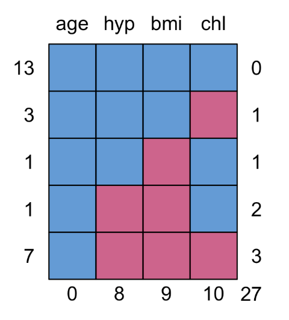

```{r packages, echo=FALSE, message=FALSE, warning=FALSE}
#library(tidyverse)
#library(magick)
library(knitr)
library(kableExtra)
#library(lattice)
#library(dplyr)
#library(ggplot2)
#library(lme4)
#library(arm)
library(mice)
library(VIM)
```

```{r setup, include=FALSE}
# R options
options(
  htmltools.dir.version = FALSE, # for blogdown
  #show.signif.stars = FALSE,     # for regression output
  warm = 1
  )
# Set dpi and height for images
knitr::opts_chunk$set(fig.height = 2.65,dpi =300,fig.align='center',fig.show='hold',size='footnotesize',small.mar=TRUE) 
# For nonsese...
htmltools::tagList(rmarkdown::html_dependency_font_awesome())
# For magick
dev.off <- function(){
  invisible(grDevices::dev.off())
}

knit_hooks$set(small.mar = function(before, options, envir) {
    if (before) par(mar =  c(4, 4, 1.5, 1.5)) 
})
```


## Illustration

- Simple example using data that come with the .hlight[MICE] package in R.

--

- Dataset from NHANES includes 25 cases measured on 4 variables.

--

- Only 13 cases with complete data.

--

- We will use multiple imputation to make completed datasets and do analyses.

--

- The four variables are
  1. age (age group: 20-39, 40-59, 60+)
  2. bmi (body mass index, in $kg/m^2$)
  3. hyp (hypertension status: no, yes)
  4. chl (total cholesterol, in $mg/dL$)


---
## Illustration

```{r}
library(mice)
data(nhanes2)
dim(nhanes2)
summary(nhanes2)
str(nhanes2)
```


---
## Patterns of missing data

```{r eval=F}
md.pattern(nhanes2)
```
```{r echo=FALSE, out.height="400px",out.width="450px"}

```

--

5 patterns observed from $2^3=8$ possible patterns


---
## Patterns of missing data

```{r echo=FALSE, out.height="320px",out.width="450px"}

```

--

- .hlight[At the bottom]: total number of missing values by variables.

--

- .hlight[On the right]: number of variables missing in each pattern.

--

- .hlight[On the left]: number of cases for each pattern.


---
## Visualizing patterns of missing data

```{r fig.height=3.2, warning=F}
library(VIM); library(lattice)
aggr(nhanes2,col=c("lightblue3","darkred"),numbers=TRUE,sortVars=TRUE,
     labels=names(nhanes2),cex.axis=.7,gap=3,
     ylab=c("Proportion missing","Missingness pattern"))
```


---
## Visualizing patterns of missing data

The .hlight[marginplot] function can be used to understand how missingness affects the distribution of values on other variables.

--

- .hlight[Blue box plots] summarize the distribution of .hlight[observed data given the other variable is observed].

--

- .hlight[Red box plots] summarize the distribution of .hlight[observed data given the other variable is missing].

--

- If data are MCAR, you expect the boxplots to be the same (hard to evaluate in this small sample)

--

Let's look at the margin plot for the two continuous variables `bmi` and `chl`.


---
## Visualizing patterns of missing data

```{r fig.height=4.5}
marginplot(nhanes2[,c("chl","bmi")],col=c("lightblue3","darkred"),cex.numbers=1.2,pch=19)
```


---
## Visualizing patterns of missing data

- Interpretation of the numbers in red.

--

  + 9 = number of observations with missingness in `bmi`
  
  + 10 = number of observations with missingness in `chl`
  
  + 7 = number of observations with missingness in both `bmi` and `chl`.

--
  
- The scatterplot of blue points display the relationship between `bmi` and `chl` when they are both observed (13 cases).

--

- The red points indicate the amount of data used to generate the red boxplots.


---
## Mice in R

We will use the .hlight[mice] function to generate 10 imputed datasets. By default, .hlight[mice] uses

- .hlight[pmm]: Predictive mean matching for numeric data

- .hlight[logreg]: Logistic regression for factor data with 2 levels

- .hlight[polyreg]: Multinomial logistic regression for factor data with > 2 levels

- .hlight[polr]: Proportional odds model for factor data with > 2 ordered levels


---
## Mice in R

Other commonly used methods are

- .hlight[norm]: Bayesian linear regression

- .hlight[sample]: Random sample from observed values

- .hlight[cart]: Classification and regression trees

- .hlight[rf]: Random forest

--

Personally, I prefer to use .hlight[norm] instead of .hlight[pmm] for imputing numeric/continuous variables. 

--

For the illustration,

```{r echo=F}
set.seed(30)
```
```{r fig.height=4.5}
nhanes2_imp <- mice(nhanes2,m=10,
                    defaultMethod=c("norm","logreg","polyreg","polr"),
                    print=F)
```

---
## Mice in R

```{r fig.height=4.5}
methods(mice)
```


---
## Predictive mean matching (pmm)

- Suppose $y$ is subject to missing values while $x$ is completely observed. The basic idea for pmm is:

--
 
  + Using complete cases, regress $y$ on $x$, obtaining $\hat{\beta} = (\hat{\beta}_0,\hat{\beta}_1)$;
  
--
 
  + Draw a new $\beta^\star$ from the "posterior distribution" of $\hat{\beta}$ (e.g, multivariate normal);
  
--
 
  + Using $\beta^\star$, generate predicted values of $y$ for all cases;
  
--
 
  + For each case with a missing $y$, identify set of donors with no missing values, who have predicted $y$ values close to that of the case with missing data;
  
--
 
  + From among these cases, randomly select one and assign its observed value of $y$ as the imputed value;
  
--
 
  + Repeat for all observations and imputation data sets.
  
--
 
- Pmm matches the distribution of the original observed variable, as imputed values are taken from the real data.


---
## Mice in R

Back to the `nhanes2_imp` object, first look at the original data
```{r}
nhanes2
```


---
## Mice in R

Look at the first imputed-dataset
```{r}
d1 <-  complete(nhanes2_imp, 1); d1
```


---
## Mice in R

Look at the last imputed-dataset
```{r}
d10 <-  complete(nhanes2_imp, 10); d10
```


---
## Illustration

Let's plot imputed and observed values for continuous variables.

```{r fig.height=3.5}
stripplot(nhanes2_imp, col=c("grey","darkred"),pch=c(1,20))
```

Grey dots are observed values and red dots are imputed values.

---
## Illustration

Let's see how this would change when we use `pmm` instead of `norm`.
```{r fig.height=3.5}
nhanes2_imp2 <- mice(nhanes2,m=10,defaultMethod=c("pmm","logreg","polyreg","polr"),print=F)
stripplot(nhanes2_imp2, col=c("grey","darkred"),pch=c(1,20))
```

Easy to see that the distribution of the original observed data is preserved.


---
## Illustration

Also can do plots by values of categorical variable, say `bmi` by `age`. Let's look at the imputations using `norm`
```{r fig.height=3.5}
stripplot(nhanes2_imp, bmi~.imp|age, col=c("grey","darkred"),pch=c(1,20))
```


---
## Illustration

Using `pmm` instead of `norm`, we have:
```{r fig.height=3.5}
stripplot(nhanes2_imp2, bmi~.imp|age, col=c("grey","darkred"),pch=c(1,20))
```

Going forward, let's focus only on imputations using `norm`.

---
## Illustration

Scatterplot of `chl` and `bmi` for each imputed dataset. Here we can see why we should not use single imputations. 
```{r fig.height=4}
xyplot(nhanes2_imp, bmi ~ chl | .imp,pch=c(1,20),cex = 1.4,col=c("grey","darkred"))
```


---
## Illustration

To detect interesting differences in distribution between observed and imputed data, use the .hlight[densityplot] function.

```{r fig.height=3.6}
densityplot(nhanes2_imp)
```


---
## Illustration: using a single dataset

For model specification, i.e., transformations, either look at the complete cases or use one of the completed datasets. For example, to use the first dataset in a regression of `bmi` on `age`, `hyp` and `chl`, use
```{r fig.height=3.6}
bmiregd1 <- lm(bmi~age+hyp+chl, data = d1)
summary(bmiregd1)
```


---
## Illustration: using a single dataset

- To check residuals, you can examine the fit of the model in one or more completed datasets

- Any transformations will have to apply to all the datasets, so don't be too dataset-specific in your checks.
  ```{r fig.height=3}
plot(bmiregd1$residual,x=d1$chl,xlab="Cholesterol",ylab="Residual"); abline(0,0)
```

  Looks good!

---
## Illustration: using a single dataset

```{r fig.height=3.3}
boxplot(bmiregd1$residual ~ d1$age, xlab = "Age", ylab = "Residual")
```

Pretty reasonable especially given the size of the dataset.


---
## Illustration: using a single dataset

```{r fig.height=3.3}
boxplot(bmiregd1$residual ~ d1$hyp, xlab = "Hypertension", ylab = "Residual")
```

- Good idea to repeat for more than one completed dataset. 

- If you decide transformations are needed, you might reconsider the imputation models too and fit them with transformed values.


---
## Illustration: using all $m$ datasets

```{r fig.height=3.3}
bmireg_imp <- with(data=nhanes2_imp, lm(bmi~age+hyp+chl))
#results for second dataset
bmireg_imp[[4]][[2]]
#results for fifth dataset
bmireg_imp[[4]][[5]]
```


---
## Illustration: using all $m$ datasets

Now to get the multiple imputation inferences based on the Rubin (1987) combining rules
```{r fig.height=3.3}
bmireg <- pool(bmireg_imp)
summary(bmireg)
```


---
## Illustration: using all $m$ datasets

- You can still do a nested F test (well, technically a test that is asymptotically equivalent to a nested F test) for the multiply-imputed dataset using the .hlight[pool.compare] function. 

- For example, suppose we want to see if age is a useful predictor, then
  ```{r fig.height=3.3, warning=F}
bmireg_imp <- with(data=nhanes2_imp, lm(bmi~hyp+chl+age))
bmireg_impnoage <- with(data=nhanes2_imp, lm(bmi~hyp+chl))
#type "pool.compare(bmireg_imp, bmireg_impnoage)" to see full results
pool.compare(bmireg_imp, bmireg_impnoage)[c(9:12,18)]
```

---
## Illustration: using all $m$ datasets

You also can fit logistic regressions.  For example to predict hypertension from all the other variables, do
```{r fig.height=3.3}
hyplogreg_imp <- with(data=nhanes2_imp, glm(hyp~bmi+chl+age, family = binomial))
```

This turns out to be problematic here because we have some logistic regressions with perfect predictions.  

---
## Illustration: using all $m$ datasets

```{r fig.height=3.3}
hyplogreg <- pool(hyplogreg_imp)
summary(hyplogreg)
```

We do not have enough data to do a meaningful logistic regression here, unless we drop age as a predictor, but the command structure is fine!


---
## Modifying predictors in the imputation models

Going back to the imputed datasets, which variables does `mice()` use as predictors for imputation of each incomplete variable?
```{r fig.height=3.3}
nhanes2_imp$predictorMatrix
```


---
## Modifying predictors in the imputation models

We can choose to exclude variables from any of the imputation models. For example, suppose we think that `hyp` should not predict `bmi`. Then, 
```{r fig.height=3.3}
pred <- nhanes2_imp$predictorMatrix
pred["bmi","hyp"] <- 0
pred
```
```{r eval=F}
mice(nhanes2,m=10,defaultMethod=c("norm","logreg","polyreg","polr"),predictorMatrix=pred)
```


---

class: center, middle

# What's next? 

### Move on to the readings for the next module!


