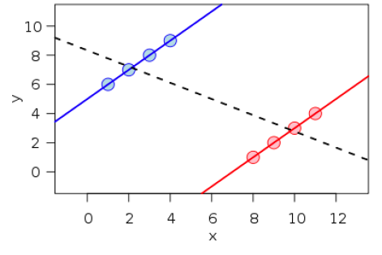

```{r packages, echo=FALSE, message=FALSE, warning=FALSE}
#library(tidyverse)
#library(magick)
library(knitr)
library(kableExtra)
library(lattice)
#library(dplyr)
#library(ggplot2)
#library(arm)
library(DiagrammeR)
```

```{r setup, include=FALSE}
# R options
options(
  htmltools.dir.version = FALSE, # for blogdown
  #show.signif.stars = FALSE,     # for regression output
  warm = 1
  )
# Set dpi and height for images
knitr::opts_chunk$set(fig.height = 2.65,dpi =300,fig.align='center',fig.show='hold',size='footnotesize',small.mar=TRUE) 
# For nonsese...
htmltools::tagList(rmarkdown::html_dependency_font_awesome())
# For magick
dev.off <- function(){
  invisible(grDevices::dev.off())
}

knit_hooks$set(small.mar = function(before, options, envir) {
    if (before) par(mar =  c(4, 4, 1.5, 1.5)) 
})
```


## Causality

--- 
<i class="fa fa-quote-left fa-2x fa-pull-left fa-border" aria-hidden="true"></i>
<i class="fa fa-quote-right fa-2x fa-pull-right fa-border" aria-hidden="true"></i>
We do not have knowledge of a thing until we have grasped its why, that is to say, <font color="red">its cause</font>.

-- Aristotle, Physics

--

</br>
- Over the next few modules, we will discuss causal inference, specifically, on measuring the .hlight[effects of causes]. 

--

- For now, we will simply lay the foundations for causal inference. 

--

- We will get more into the actual methods later.


---
## Association vs. causation

- In the models we have covered so far, our focus has been on inferring .hlight[associations] using samples drawn from our population of interest.

--

- For example, we have been asking questions such as, do people who receive job training tend to earn more wages than people who do not?

--

- Causal inference goes further as we try to infer aspects of the actual data generating process, that is, .hlight[causation].

--

- For example, does receiving job training actually cause one to earn more wage than they would have without the training?

--

- The additional information needed to move from association to causation is often provided by .hlight[causal assumptions] (often untestable).

--

- Note: in most cases, .hlight[association does not imply causation]!


---
## Confounding

- Why is it that association does not often imply causation? .hlight[confounding variables or confounders]!

--

- Causal relationship
```{r echo=F, fig.height=0.6}
mermaid("
	        graph LR
	        W(Treatment)-->Y(Outcome)
	        ")
```

--

- Confounding
```{r echo=F, fig.height=0.6}
mermaid("
	        graph TB
	        C(Confounder)-->W(Treatment)
	        C-->Y(Outcome)
	        ")
```


---
## Examples of confounding

- Ice cream consumption and number of people who drowned.  
  .hlight[Confounder: temperature]; people tend to consume more ice cream and also swim more when it is hot.

--

- Medical treatment and patient outcome.  
  .hlight[Confounders: age, sex, other complications]
  
--

- Education and income.  
  .hlight[Confounder: socio-economic status of family]
  
--

- An extreme example of confounding is Simpson’s paradox: where  a confounder reverses the sign of the correlation between treatment and outcome


---
## Simpson's paradox


- Example: kidney stone treatment (Charig et al., BMJ, 1986).
  + Compare the success rates of two treatments for kidney stones
  
--

  + Treatment A: open surgery. Treatment B: small puncture

--

<br />       | Treatment A | Treatment B   |
:----------- | :--------- | :---------   |
Small stones | <b>93%</b> (81/87) | 87% (234/270) |
Large stones | <b>73%</b> (192/263) | 69% (55/80) |
Both         | 78% (273/350) | <b>83%</b> (289/350) |

--

  + Overall treatmnent B has a higher success rate but treatment A actually has higher success rates given the type of stones.
  
--

  + What is the confounder here? Severity of the case/type of stones.
  
  
---
## Simpson's paradox or Yule-Simpson effect

- Simpson’s paradox: a trend appears in different groups of data but disappears or reverses when these groups are combined.

```{r echo=FALSE, out.height="300px",out.width="400px"}

```

--

- Mathematically, it is about conditioning.

--

- Another well-known example is the Berkeley admission gender bias (Bickel et al., Science, 1976).


---
## General notation

- .hlight[W]: Treatment (e.g. job training); we will focus on binary treatments.

- .hlight[Y]: Outcome (e.g. annual wages).

- .hlight[X]: Observed predictors or confounders (e.g. age, education, etc).

- .hlight[U]: Unobserved predictors or confounders.

</br>

--

- Examples of causal questions:
  + Causal effect of exposure to a disease.
  
  + Comparative effectiveness research such as in clinical trials: whether one drug or medical procedure is better than the other.
  
  + Program evaluation in economics and policy.


---
class: center, middle

# Potential outcomes framework


---
## Potential outcomes framework

- The .hlight[potential outcomes framework] or .hlight[counterfactual framework] or .hlight[Rubin Causal Model (RCM)] is arguably the most widely used framework across many disciplines, e.g., medicine, health care, policy, social sciences.

--

- Under this framework, causal inference is viewed as a problem of missing data with explicit mathematical modeling of the assignment mechanism as a process for revealing the observed data.

--

- Rooted in the statistical work on randomized experiments by Fisher (1918, 1925) and Neyman (1923), as extended by Rubin (1974, 1976, 1977, 1978, 1990).


---
## Potential outcomes framework

- For a binary treatment, each individual gets exactly one of the two options, and we observe the corresponding response for that. 

--

- Conceptually, under the potential outcomes framework, we think about what each individual's response should have been had they gotten the other treatment option instead of the one they actually got.

--

- The individual causal effect then is the difference between the two "potential" outcomes, only one of which is observed.

--

- Clearly, we never observe the two potential outcomes for any individual, making it natural to think of this as a missing data problem.


---
## Potential outcomes framework

- No causation without manipulation - "cause" must be (hypothetically speaking) something we can manipulate. e.g., intervention, action, treatment.

--

- That is, gender, time and age are not well defined “causes" under the RCM.

--

- Three integral components of the potential outcomes framework:
  + .hlight[potential outcomes] corresponding to the various levels of a treatment.
  
  + .hlight[assignment mechanisms], that is, the treatment indicator for all observations.
  
  + a .hlight[model] for the science (the potential outcomes and covariates).


---
## Potential outcomes framework: basic concepts

- .hlight[Unit]: The person, place, or thing upon which a treatment will operate, at a particular time (note: a single person, place, or thing at two different times comprises two different units).

--

- .hlight[Treatment]: An intervention, the effects of which (on some particular measurement of the units) the investigator wishes to assess relative to no intervention (i.e., the control).

--

- .hlight[Potential Outcomes]: The values of a unit’s measurement of interest after (a) application of the treatment and (b) non-application of the treatment (i.e., under control).

--

- .hlight[Causal Effect]: For each unit, the comparison of the potential outcome under treatment and the potential outcome under control.


---
## Causal effects

- For a single unit, let $Y(0)$ denote the outcome given the control treatment and $Y(1)$, the outcome given the active treatment.

--

- For example, suppose $Y$ denotes a score (level of severity) for headache, then for a single unit, we could have

--

<table>
  <caption>Raw scores</caption>
  <tr>
    <th>Unit</th>
    <th>Initial headache</th>
    <th height="30px" colspan="2">Potential outcomes</th>
    <th>Causal effect</th>
  </tr>
  <tr>
    <th> </th>
    <td height="30px" style="text-align:center" width="100px"> X </td>
    <td style="text-align:center" width="100px"> Y(asp) </td>
    <td style="text-align:center" width="100px"> Y(not) </td>
    <td style="text-align:center" width="250px"> Y(asp) - Y(not) </td>
  </tr>
  <tr>
    <td height="30px" style="text-align:center" width="80px"> you</td>
    <td style="text-align:center"> 80 </td>
    <td style="text-align:center"> 25 </td>
    <td style="text-align:center"> 75 </td>
    <td style="text-align:center"> -50 </td>
  </tr>
</table>

--

<table>
  <caption>Gain scores</caption>
  <tr>
    <th>Unit</th>
    <th>Initial headache</th>
    <th height="30px" colspan="2">Potential outcomes</th>
    <th>Causal effect</th>
  </tr>
  <tr>
    <th> </th>
    <td height="30px" style="text-align:center" width="100px"> X </td>
    <td style="text-align:center" width="100px"> Y(asp) - X </td>
    <td style="text-align:center" width="100px"> Y(not) - X </td>
    <td style="text-align:center" width="250px"> [Y(asp) - X] - [Y(not) - X] </td>
  </tr>
  <tr>
    <td height="30px" style="text-align:center" width="80px"> you</td>
    <td style="text-align:center"> 80 </td>
    <td style="text-align:center"> -55 </td>
    <td style="text-align:center"> -5 </td>
    <td style="text-align:center"> -50 </td>
  </tr>
</table>


---
## The fundamental problem of causal inference

As mentioned before,

- The fundamental problem of causal inference: we can observe at most one of the potential outcomes for each unit.

--

- Causal inference under the potential outcome framework is essentially a missing data problem.

--

- To identify causal effects from observed data, under any mathematical framework, one must make assumptions (structural or/and stochastic)

--

- Since we can at most observe a single potential outcome, we must rely on multiple units (and a lot of assumptions) to make causal inferences.


---
## Basic setup

- .hlight[Target population]: a well-defined population of individuals whose outcomes are going to be compared

--

- .hlight[Data]: a random sample of $N$ units from a target population.

--

- A treatment with two levels: $w = 0,1$.

--

- For each unit $i$, we observe 
  + the binary treatment status $W_i \in \{0,1\}$, 
  
  + a vector of $p$ predictors/covariates $X_i = (X_{i1}, \ldots, X_{ip})$, and 
  
  + an outcome $Y_i^{\text{obs}}$.


---
## Basic setup

- For each unit $i$, there are two potential outcomes $(Y_i(0),Y_i(1))$.

--

- That is, the outcomes under the two values of the treatment, at most one of which is observed.

--

- Potential outcomes and assignments jointly determine the values of the observed outcomes
.block[
$$
Y_i^{\text{obs}} \equiv Y_i(W_i) = W_i \cdot Y_i(1) + (1-W_i) \cdot Y_i(0)
$$
]

--

  and the missing outcomes:
.block[
$$
Y_i^{\text{mis}} \equiv Y_i(1-W_i) = (1-W_i) \cdot Y_i(1) + W_i \cdot Y_i(0)
$$
]

---
## Causal estimands

- The .hlight[average treatment effect (ATE)]:
.block[
$$
\tau = \mathbb{E}[Y_i(1) - Y_i(0)].
$$
]

--

- The .hlight[average treatment effect for the treated (ATT)]:
.block[
$$
\tau = \mathbb{E}[Y_i(1) - Y_i(0) | W_i = 1].
$$
]

--

- The .hlight[average treatment effect for the control (ATC)]:
.block[
$$
\tau = \mathbb{E}[Y_i(1) - Y_i(0) | W_i = 0].
$$
]

--

- For binary outcomes, .hlight[causal odds ratio (OR) or risk ratio (RR):]:
.block[
$$
\tau = \dfrac{\mathbb{Pr}[Y_i(1) = 1]/\mathbb{Pr}[Y_i(1) = 0]}{\mathbb{Pr}[Y_i(0) = 1]/\mathbb{Pr}[Y_i(0) = 0]}.
$$
]

- Obviously these estimands are not identifiable without further assumptions.

--

- We will start to explore those soon.


---
## Example

<table>
  <tr>
    <th> </th>
    <th height="30px" colspan="2">Potential Outcomes</th>
    <th> </th>
    <th height="30px" colspan="3">Observed Data</th>
  </tr>
  <tr>
    <th> </th>
    <td height="30px" style="text-align:center" width="100px"> Y(0) </td>
    <td style="text-align:center" width="100px"> Y(1) </td>
    <td style="text-align:center" width="100px">  </td>
    <td style="text-align:center" width="100px"> W </td>
    <td height="30px" style="text-align:center" width="100px"> Y(0) </td>
    <td style="text-align:center" width="100px"> Y(1) </td>
  </tr>
  <tr>
    <td height="30px" style="text-align:center" width="100px">  </td>
    <td style="text-align:center"> 13 </td>
    <td style="text-align:center"> 14 </td>
    <td style="text-align:center"> </td>
    <td style="text-align:center"> 1 </td>
    <td style="text-align:center"> ? </td>
    <td style="text-align:center"> 14 </td>
  </tr>
  <tr>
    <td height="30px" style="text-align:center" width="100px">  </td>
    <td style="text-align:center"> 6 </td>
    <td style="text-align:center"> 0 </td>
    <td style="text-align:center"> </td>
    <td style="text-align:center"> 0 </td>
    <td style="text-align:center"> 6 </td>
    <td style="text-align:center"> ? </td>
  </tr>
  <tr>
    <td height="30px" style="text-align:center" width="100px">  </td>
    <td style="text-align:center"> 4 </td>
    <td style="text-align:center"> 1 </td>
    <td style="text-align:center"> </td>
    <td style="text-align:center"> 0 </td>
    <td style="text-align:center"> 4 </td>
    <td style="text-align:center"> ? </td>
  </tr>
  <tr>
    <td height="30px" style="text-align:center" width="100px">  </td>
    <td style="text-align:center"> 5 </td>
    <td style="text-align:center"> 2 </td>
    <td style="text-align:center"> </td>
    <td style="text-align:center"> 0 </td>
    <td style="text-align:center"> 5 </td>
    <td style="text-align:center"> ? </td>
  </tr>
  <tr>
    <td height="30px" style="text-align:center" width="100px">  </td>
    <td style="text-align:center"> 6 </td>
    <td style="text-align:center"> 3 </td>
    <td style="text-align:center"> </td>
    <td style="text-align:center"> 0 </td>
    <td style="text-align:center"> 6 </td>
    <td style="text-align:center"> ? </td>
  </tr>
  <tr>
    <td height="30px" style="text-align:center" width="100px">  </td>
    <td style="text-align:center"> 6 </td>
    <td style="text-align:center"> 1 </td>
    <td style="text-align:center"> </td>
    <td style="text-align:center"> 0 </td>
    <td style="text-align:center"> 6 </td>
    <td style="text-align:center"> ? </td>
  </tr>
  <tr>
    <td height="30px" style="text-align:center" width="100px">  </td>
    <td style="text-align:center"> 8 </td>
    <td style="text-align:center"> 10 </td>
    <td style="text-align:center"> </td>
    <td style="text-align:center"> 1 </td>
    <td style="text-align:center"> ? </td>
    <td style="text-align:center"> 10 </td>
  </tr>
  <tr>
    <td height="30px" style="text-align:center" width="100px">  </td>
    <td style="text-align:center"> 8 </td>
    <td style="text-align:center"> 9 </td>
    <td style="text-align:center"> </td>
    <td style="text-align:center"> 1 </td>
    <td style="text-align:center"> ? </td>
    <td style="text-align:center"> 9 </td>
  </tr>
  <tr>
    <td height="30px" style="text-align:center" width="100px"> True averages </td>
    <td style="text-align:center"> 7 </td>
    <td style="text-align:center"> 5 </td>
    <td style="text-align:center"> Observed averages </td>
    <td style="text-align:center"> </td>
    <td style="text-align:center"> 5.4 </td>
    <td style="text-align:center"> 11 </td>
  </tr>
</table>


---
## Acknowledgements

These slides contain materials adapted from courses taught by Dr. Fan Li.


---

class: center, middle

# What's next? 

### Move on to the readings for the next module!


