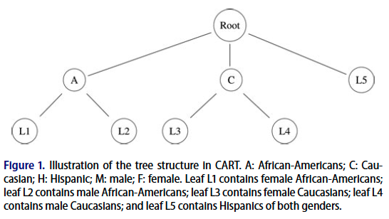

```{r packages, echo=FALSE, message=FALSE, warning=FALSE}
#library(tidyverse)
#library(magick)
library(knitr)
#library(kableExtra)
#library(lattice)
#library(dplyr)
#library(ggplot2)
#library(arm)
```

```{r setup, include=FALSE}
# R options
options(
  htmltools.dir.version = FALSE, # for blogdown
  #show.signif.stars = FALSE,     # for regression output
  warm = 1
  )
# Set dpi and height for images
knitr::opts_chunk$set(fig.height = 2.65,dpi =300,fig.align='center',fig.show='hold',size='footnotesize',small.mar=TRUE) 
# For nonsese...
htmltools::tagList(rmarkdown::html_dependency_font_awesome())
# For magick
dev.off <- function(){
  invisible(grDevices::dev.off())
}

knit_hooks$set(small.mar = function(before, options, envir) {
    if (before) par(mar =  c(4, 4, 1.5, 1.5)) 
})
```


## Tree-based methods

- The regression approaches we have covered so far in this course are all .hlight[parametric]. 

--

- .hlight[Parametric] means that we need to assume an underlying probability distribution to explain the randomness.

--

- For example, for linear regression,
.block[
.small[
$$y_i = \beta_0 + \beta_1 x_{i1} + \epsilon_i; \ \ \epsilon_i \overset{iid}{\sim} N(0, \sigma^2),$$
]
]

  we assume a normal distribution.
  
--

- For logistic regression,
.block[
.small[
$$
\begin{split}
y_i | x_i \sim \textrm{Bernoulli}(\pi_i); \ \ \ & \textrm{log}\left(\dfrac{\pi_i}{1-\pi_i}\right) = \beta_0 + \beta_1 x_i,
\end{split}
$$
]
]

  we assume a Bernoulli distribution.
  
  
---
## Tree-based methods

- All the models we have covered requires specifying function for the mean or odds, and specifying distribution for randomness.

--

- We may not want to run the risk of mis-specifying those.

--

- As an alternative one can turn to .hlight[nonparametric models] that optimize certain criteria rather than specify models.
  + Classification and regression trees (CART)
  
  + Random forests
  
  + Boosting
  
  + Other machine learning methods
  
--

- Over the next few modules, we will briefly discuss a few of those methods.


---
## CART

- Goal: predict outcome variable from several predictors.

--

- Can be used for categorical outcomes (classification trees) or continuous outcomes (regression trees).

--

- Let $Y$ represent the outcome and $X$ represent the predictors.

--

- CART recursively partitions the predictor space in a way that can be effectively represented by a tree structure, with leaves corresponding to the subsets of units.


---
## CART for categorical outcomes

- Partition $X$ space so that subsets of individuals formed by partitions have relatively homogeneous $Y$.

--

- Partitions from recursive binary splits of $X$.

--

- Grow tree until it reaches pre-determined maximum size (minimum number of points in leaves).

--

- Various ways to prune tree based on cross validation.

--

- Making predictions:

--

  + For any new $X$, trace down tree until you reach the appropriate leaf.
  
--

  + Use value of $Y$ that occurs most frequently in leaf as the prediction.


---
## CART

```{r echo=FALSE, out.height="480px",out.width="600px"}

```


---
## CART for categorical outcomes

- To illustrate, Figure 1 displays a fictional regression tree for 
  + an outcome variable.
  + two predictors, gender (male or female) and race/ethnicity (African-American, Caucasian, or Hispanic).
  
--

- To approximate the conditional distribution of $Y$ for a particular gender and race/ethnicity combination, one uses the values in the corresponding leaf.

--

- For example, to predict a $Y$ value for for female Caucasians, one uses the $Y$ value that occurs most frequently in leaf $L3$.


---
## CART for continuous outcomes

- Same idea as for categorical outcomes: grow tree by recursive partitions on $X$.

--

- Use the variance of the $Y$ values as a splitting criterion:
  choose the split that makes the sum of the variances of the $Y$ values in the leaves as small as possible.

--

- When making predictions for new $X$, use the average value of $Y$ in the leaf for that $X$.


---
## Model diagnostics

- Can look at residuals, but...

--

  + No parametric model, so for continuous outcomes we can’t check for linearity, non constant variance, normality, etc.
  
--

  + Big residuals identify $X$ values for which the predictions are not close to the actual $Y$ values. But...what should we do with them?
  
--

  + Could use binned residuals for logistic regression, but they only tell you where model does not give good predictions.
  
--

- Transforming the $X$ values is irrelevant for trees (as long as transformation is monotonic, like logs)

--

- Can still do model validation, that is, compute and compare RMSEs, AUC, accuracy, and so on.


---
## CART vs. parametric regression: benefits

- No parametric assumptions.

--

- Automatic model selection.

--

- Multi-collinearity not problematic.

--

- Useful exploratory tool to find important interactions.

--

- In R, use `tree` or `rpart`.


---
## CART vs. parametric regression: limitations

- Regression predictions forced to range of observed $Y$ values. May or may not be a limitation depending on the context.

--

- Bins continuous predictors, so fine grained relationships lost.

--

- Finds one tree, making it hard to interpret chance error for that tree.

--

- No obvious ways to assess variable importance.

--

- Harder to interpret effects of individual predictors.

--

Also, One big tree is limiting, but, we need different datasets or variables to grow more than one tree...


---

class: center, middle

# What's next? 

### Move on to the readings for the next module!


